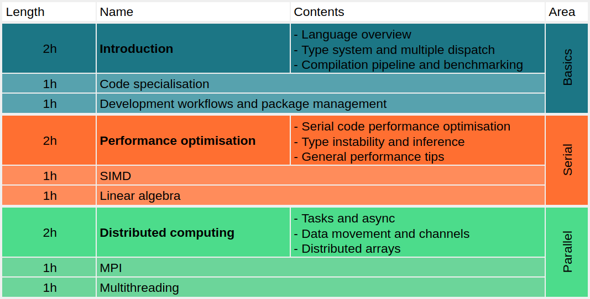

<div align="center">
  <a href="TODO"></a>
  <a href="TODO">![badge](https://img.shields.io/badge/launch-2023.01.10-579ACA.svg?logo=data:image/png;base64,iVBORw0KGgoAAAANSUhEUgAAAFkAAABZCAMAAABi1XidAAAB8lBMVEX///9XmsrmZYH1olJXmsr1olJXmsrmZYH1olJXmsr1olJXmsrmZYH1olL1olJXmsr1olJXmsrmZYH1olL1olJXmsrmZYH1olJXmsr1olL1olJXmsrmZYH1olL1olJXmsrmZYH1olL1olL0nFf1olJXmsrmZYH1olJXmsq8dZb1olJXmsrmZYH1olJXmspXmspXmsr1olL1olJXmsrmZYH1olJXmsr1olL1olJXmsrmZYH1olL1olLeaIVXmsrmZYH1olL1olL1olJXmsrmZYH1olLna31Xmsr1olJXmsr1olJXmsrmZYH1olLqoVr1olJXmsr1olJXmsrmZYH1olL1olKkfaPobXvviGabgadXmsqThKuofKHmZ4Dobnr1olJXmsr1olJXmspXmsr1olJXmsrfZ4TuhWn1olL1olJXmsqBi7X1olJXmspZmslbmMhbmsdemsVfl8ZgmsNim8Jpk8F0m7R4m7F5nLB6jbh7jbiDirOEibOGnKaMhq+PnaCVg6qWg6qegKaff6WhnpKofKGtnomxeZy3noG6dZi+n3vCcpPDcpPGn3bLb4/Mb47UbIrVa4rYoGjdaIbeaIXhoWHmZYHobXvpcHjqdHXreHLroVrsfG/uhGnuh2bwj2Hxk17yl1vzmljzm1j0nlX1olL3AJXWAAAAbXRSTlMAEBAQHx8gICAuLjAwMDw9PUBAQEpQUFBXV1hgYGBkcHBwcXl8gICAgoiIkJCQlJicnJ2goKCmqK+wsLC4usDAwMjP0NDQ1NbW3Nzg4ODi5+3v8PDw8/T09PX29vb39/f5+fr7+/z8/Pz9/v7+zczCxgAABC5JREFUeAHN1ul3k0UUBvCb1CTVpmpaitAGSLSpSuKCLWpbTKNJFGlcSMAFF63iUmRccNG6gLbuxkXU66JAUef/9LSpmXnyLr3T5AO/rzl5zj137p136BISy44fKJXuGN/d19PUfYeO67Znqtf2KH33Id1psXoFdW30sPZ1sMvs2D060AHqws4FHeJojLZqnw53cmfvg+XR8mC0OEjuxrXEkX5ydeVJLVIlV0e10PXk5k7dYeHu7Cj1j+49uKg7uLU61tGLw1lq27ugQYlclHC4bgv7VQ+TAyj5Zc/UjsPvs1sd5cWryWObtvWT2EPa4rtnWW3JkpjggEpbOsPr7F7EyNewtpBIslA7p43HCsnwooXTEc3UmPmCNn5lrqTJxy6nRmcavGZVt/3Da2pD5NHvsOHJCrdc1G2r3DITpU7yic7w/7Rxnjc0kt5GC4djiv2Sz3Fb2iEZg41/ddsFDoyuYrIkmFehz0HR2thPgQqMyQYb2OtB0WxsZ3BeG3+wpRb1vzl2UYBog8FfGhttFKjtAclnZYrRo9ryG9uG/FZQU4AEg8ZE9LjGMzTmqKXPLnlWVnIlQQTvxJf8ip7VgjZjyVPrjw1te5otM7RmP7xm+sK2Gv9I8Gi++BRbEkR9EBw8zRUcKxwp73xkaLiqQb+kGduJTNHG72zcW9LoJgqQxpP3/Tj//c3yB0tqzaml05/+orHLksVO+95kX7/7qgJvnjlrfr2Ggsyx0eoy9uPzN5SPd86aXggOsEKW2Prz7du3VID3/tzs/sSRs2w7ovVHKtjrX2pd7ZMlTxAYfBAL9jiDwfLkq55Tm7ifhMlTGPyCAs7RFRhn47JnlcB9RM5T97ASuZXIcVNuUDIndpDbdsfrqsOppeXl5Y+XVKdjFCTh+zGaVuj0d9zy05PPK3QzBamxdwtTCrzyg/2Rvf2EstUjordGwa/kx9mSJLr8mLLtCW8HHGJc2R5hS219IiF6PnTusOqcMl57gm0Z8kanKMAQg0qSyuZfn7zItsbGyO9QlnxY0eCuD1XL2ys/MsrQhltE7Ug0uFOzufJFE2PxBo/YAx8XPPdDwWN0MrDRYIZF0mSMKCNHgaIVFoBbNoLJ7tEQDKxGF0kcLQimojCZopv0OkNOyWCCg9XMVAi7ARJzQdM2QUh0gmBozjc3Skg6dSBRqDGYSUOu66Zg+I2fNZs/M3/f/Grl/XnyF1Gw3VKCez0PN5IUfFLqvgUN4C0qNqYs5YhPL+aVZYDE4IpUk57oSFnJm4FyCqqOE0jhY2SMyLFoo56zyo6becOS5UVDdj7Vih0zp+tcMhwRpBeLyqtIjlJKAIZSbI8SGSF3k0pA3mR5tHuwPFoa7N7reoq2bqCsAk1HqCu5uvI1n6JuRXI+S1Mco54YmYTwcn6Aeic+kssXi8XpXC4V3t7/ADuTNKaQJdScAAAAAElFTkSuQmCC)</a>
</div>

# Jupyter for HPC - EuXFEL Trial Run

Indico event page - https://indico.desy.de/event/36933/

## Introduction

Julia is a language created specifically for use in scientific computing, it aims to offer the performance of low-level compiled language while retaining the simplicity and ease of use of high-level interpreted languages like Python.

This workshop covers the foundations of the language, showing its unique features and use cases, and gives an overview of the key concepts required to achieve high performance in Julia.

The course is roughly structured as follows:



Familiarity with a programming language and Jupyter notebooks is required, but no experience with Julia is needed.

This workshop is an internal trial run for the EuXFEL Data Department to test the viability of providing such a workshop to users and the photon science community at large, so expect some lack of polish and growing pains.

The schedule is still not determined. As shown in the image above each area (basics, serial, and parallel) has one main session which is two hours long, and two shorter (optional) sessions which are one hour long each and include some exercises. Given this there are two options for running the workshop:

## Software Setup

You can participate from any linux-based computer, the only requirements are Julia and Jupyter (Lab).

### Maxwell

Easiest option is to use [Max-JHub](https://max-jhub.desy.de/hub), as Julia is already available on the cluster. There's no need to allocate a dedicated node, shared nodes are fine for the contents in these notebooks.

You can start a JHub session via https://max-jhub.desy.de/hub/spawn

Julia is provided with the module system, in a terminal run `module load maxwell julia` to load Julia

### Personal Computer

If you are using your own computer then you will need to install Julia either via your package manager or (**recommended**) using [JuliaUp](https://github.com/JuliaLang/juliaup):

```sh
curl -fsSL https://install.julialang.org | sh
juliaup add 1.8  # this has been written and tested using 1.8.4, any version ~1.8 should work
```

If you do not have JupyterLab installed, then you can install it in Python via in your preferred way (`pipx`, `pip`, `conda`, etc...).

## Getting the Course

Clone this repository under your user directory, a branch has been set up for this event:

```sh
git clone https://github.com/RobertRosca/julia-hpc-workshop.git
cd julia-hpc-workshop
# module load maxwell julia  # If you are on Maxwell
make setup  # will install required Julia dependencies
```

## Static Site

A static version of the notebooks is available here: TODO

## Binder

Binder sessions for this can be started here (note that you will **lose any changes** unless you export the notebook files and download them): TODO
